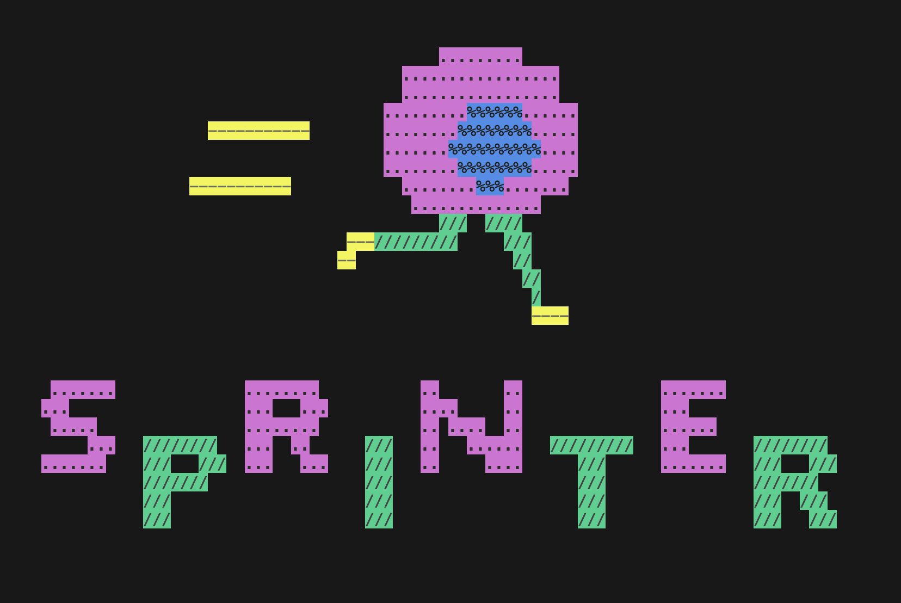

# SPRINTER <br/> <sub><u>S</u>ingle-cell <u>P</u>roliferation <u>R</u>ate <u>I</u>nference in <u>N</u>on-homogeneous <u>T</u>umours through <u>E</u>volutionary <u>R</u>outes</sub> #

SPRINTER is an algorithm that uses single-cell whole-genome DNA sequencing data to enable the accurate identification of actively replicating cells in both the S and G2 phases of the cell cycle and their assignment to distinct tumour clones, thus providing a proxy to estimate clone-specific proliferation rates.

SPRINTER algorithm and its applications are described in the related manuscript:

[Lucas, Ward, Zaidi, Bunkum, ..., Zaccaria, *Nature Genetics*, 2024](https://doi.org/10.1038/s41588-024-01989-z)

This repository includes detailed instructions for installation and requirements, demos, and contacts.
A fully reproducible capsule for testing SPRINTER is available in CodeOcean at:

[SPRINTER's CodeOcean capsule](https://doi.org/10.24433/CO.4888914.v1)



## Contents ##

1. [Quick start](#quick)
2. [Installation](#installation)
3. [Usage](#usage)
    - [Input data](#requireddata)
    - [System requirements](#requirements)
    - [Demos](#demos)
    - [Recommendations and quality control](#qc)
    - [Outputs](#outputs)
4. [Contacts](#contacts)

<a name="quick"></a>
## Quick start

The installation and execution of SPRINTER can be reviewed and tested using the reproducible capsule published in CodeOcean at:

[SPRINTER's CodeOcean capsule](https://doi.org/10.24433/CO.4888914.v1)

<a name="installation"></a>
## Installation

SPRINTER is written in Python3 and is distributed through [bioconda](https://bioconda.github.io/).
Thus, the recommended installation is using `conda`, that can be installed locally on any machine using any of the many available distributions, including the reccommended [Miniforge](https://github.com/conda-forge/miniforge), the compact [Miniconda](https://docs.conda.io/en/latest/miniconda.html), or the complete [Anaconda](https://www.anaconda.com/).

Note that `bioconda` [requires](https://bioconda.github.io/) the one-time execution of these `conda` commands, or any equivalent configuration:
```shell
conda config --add channels bioconda
conda config --add channels conda-forge
conda config --set channel_priority strict
```

As such, SPRINTER can be installed into a dedicated environment (in this case called `sprinter`, but the name can be changed to anything with `-n any_name`) with the following single-line command:
```shell
conda create -n sprinter -c bioconda sprinter
```

In general and especially in the case of performance issues, the use of `mamba` (available in Miniforge by default and installable in the base environment of any conda distribution) is recommended, replacing `conda create` with `mamba create`.

After the installation, the environment can be activated and SPRINTER commands can be executed from within:
```shell
conda activate sprinter
sprinter
```

In case SPRINTER has to be manually installed, please read the [basic requirements](doc/basic_requirements.md).

<a name="usage"></a>
## Usage

1. [Required data](#requireddata)
2. [System requirements](#requirements)
3. [Demos](#demos)
4. [Recommendations and quality control](#qc)
5. [Outputs](#outputs)

<a name="requireddata"></a>
### Required input

SPRINTER requires a single input, which is a TSV dataframe file (which can be `gz` compressed) containing single-cell read counts per 50kb genomic regions across autosomes (the same as those specified in the [RT file](sprinter/resources/rtscores.csv.gz) included in this repository).
This file can be automatically created using the `chisel_rdr` command of [CHISEL](https://github.com/raphael-group/chisel) starting from a standard barcoded single-cell BAM file, as shown in the corresponding [prepare input demo](demos/prep_input/demo_prep_input.sh) included in this repository.

In detail, the input TSV dataframe file has to contain the following columns (note that the current version of SPRINTER requires genomic regions to be the same as those defined in in the [RT file](sprinter/resources/rtscores.csv.gz)):

| **Name** | **Description** |
|---------|----------------|
| `CHR` | Chromosome name |
| `START` | Start position of the genomic bin |
| `END` | End position of the genomic bin |
| `CELL` | Cell unique name |
| `NORM_COUNT` | Number of sequencing reads from a control for the bin |
| `COUNT` | Number of sequencing reads from the cell `CELL` in the bin |
| `RAW_RDR` | Estimated raw, uncorrected read-depth ratio (RDR, currently ignored, it can be anything) |

Example input files are available in [Zenodo](https://doi.org/10.5281/zenodo.14060547).

In addition, SPRINTER requires the corresponding reference genome in FASTA format with the required indexes to be provided for the accurate calculation of GC content.
When the reference genome is not provided, GC content pre-calculated from reference genome hg19 will be used.
However, it is always reccommended to specify the reference genome in FASTA format using the argument `-r` as shown in the demos.

<a name="requirements"></a>
### System requirements

SPRINTER is highly parallelised in order to make the extensive computations performed for each cell efficient, often splitting independent computations to parallel processes. We recommend executing SPRINTER on multi-processing computing machines. The minimum system requirements that we have tested for running the demos are:
- CPU with at least 2 virtual cores
- 12GB of RAM

However, input data with higher number of cells will require machines with more memory (>50GB) and more processors (>12) to make the execution efficient.

<a name="demos"></a>
### Demos

In addition to the reproducible SPRINTER capsule with demos available in [CodeOcean](https://doi.org/10.24433/CO.4888914.v1), this repository includes demos to demonstrate and reproduce the exceution of SPRINTER from either the command line or an interactive notebook, and the preparation of the required input.
The available demos are reported here below.

| **Demo** | **Description** |
|----------|-----------------|
| [Prepare input](demos/prep_input/demo_prep_input.sh) | Demo of generating SPRINTER input file |
| [SPRINTER execution from command line](demos/run_sprinter/demo_run_sprinter.sh) | Demo of executing SPRINTER from the command line |
| [SPRINTER execution from interactive notebook](demos/run_sprinter_libs/run_sprinter.ipynb) | Demo of executing SPRINTER from an interactive Jupyter notebook |

<a name="qc"></a>
### Recommendations and quality control

The following recommendations guide the user in the process of quality control for the final results and of tuning SPRINTER to obtain the most accurate results from different and noisy datasets.

| **Recommendation** | **Description** |
|--------------------|-----------------|
| [Tuning bin sizes](doc/rec_binsizes.md) | Vary the size of the bins used to tune the resolution of inferred CNA and RT events. |
| [Varying outlying fractions](doc/rec_outfracs.md) | Vary the expected fraction of outlying cells. |
| [Tuning clone selection](doc/rec_selclones.md) | Tune parameters for clone selection from inferred copy numbers. |
| [Selecting cells to analyse](doc/rec_selcells.md) | Select cells to analyse. |
| [Tuning GC-content correction](doc/rec_gccorr.md) | Tune how strict the GC-bias correction should be. |
| [Control cell ploidy](doc/rec_maxploidy.md) | Control the maximum cancer cell ploidy to be inferred. |


<a name="outputs"></a>
### Outputs

From the analysed cells, SPRINTER infers multiple information, which are reported into multiple output files described below.

| **Output** | **Description** |
|------------|-----------------|
| [sprinter.output.tsv.gz](doc/output_clonephase.md) | Inferred clone and cell cycle phase for every analysed cell. |
| [cn_all_corrected.tsv.gz](doc/output_cncells.md) | Inferred copy numbers across all genomic regions for every analysed cell. |
| [cn_clones.tsv.gz](doc/output_cnclones.md) | Inferred consensus copy numbers across all genomic regions for every identified clone. |
| [rtinferred_clones.tsv.gz](doc/output_infrt.md) | Inferred altered replication timing across all genomic regions for every identified clone. |

<a name="contacts"></a>
## Contacts

SPRINTER's repository is actively maintained by Olivia Lucas, PhD student at the UCL Cancer Institute, and [Simone Zaccaria](http://www.ucl.ac.uk/cancer/zaccaria-lab), group leader of the [Computational Cancer Genomics research group](https://sites.google.com/view/ccgresearchgroup) at the UCL Cancer Institute.
